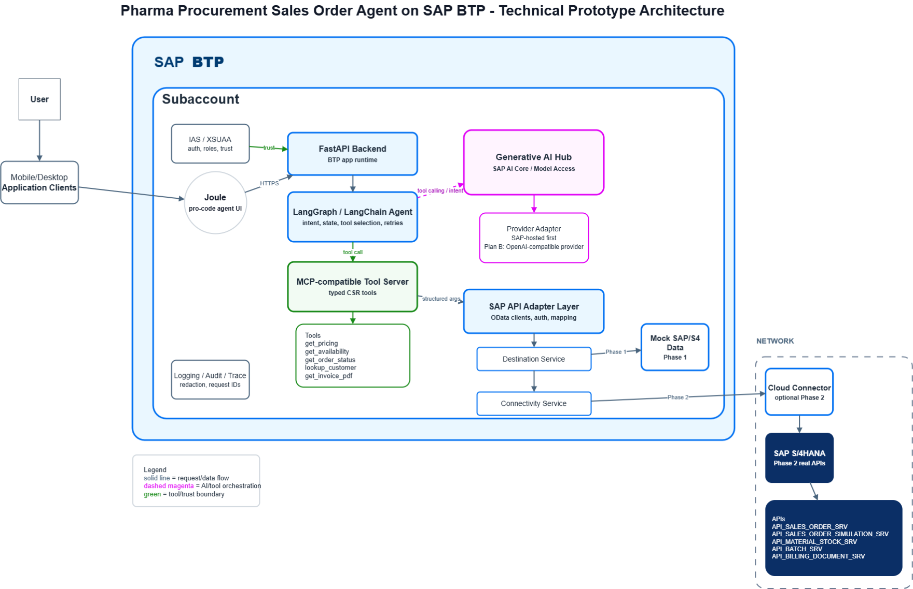

# Pharma Procurement Sales Order Agent

A reference implementation of an agentic sales-order support pattern for pharmaceutical procurement scenarios.

The project demonstrates how a Joule / Pro-Code user experience can call a FastAPI backend, route a natural-language request to a LangGraph/LangChain agent, execute MCP-compatible tools, and consolidate evidence from SAP S/4HANA-like structures. The repository uses synthetic demo data only and does not contain customer-specific data or productive SAP credentials.

## Architecture



High-level runtime flow:

```text
User in Joule or test UI
  -> Joule scenario or web test route
  -> FastAPI backend
  -> LangGraph / LangChain sales-order agent
  -> tool-calling model through SAP AI Core / Generative AI Hub or another configured provider
  -> MCP-compatible stdio tool server
  -> synthetic SAP S/4HANA-like tools and JSON data
  -> concise answer with evidence and operational next steps
```

The implementation keeps the UI, orchestration, model access, and tool layer independent. This makes the prototype useful for discussing target architecture before replacing synthetic data with live SAP APIs.

## Scope

This repository is a technical prototype. It is intended to illustrate the following architectural concepts:

| Area | Demonstrated pattern |
| --- | --- |
| Conversational entry point | Joule streamed-message integration plus a lightweight web test UI. |
| Agent orchestration | LangGraph state graph with LangChain tool calling. |
| Tool abstraction | MCP-compatible stdio server exposing domain tools. |
| SAP data modelling | Synthetic JSON data shaped around common SAP S/4HANA sales-order structures. |
| Write-like actions | Preview-only responses for potentially transactional operations. |
| Observability | Structured logs for LLM usage, tool calls, route, model, and duplicate Joule stream handling. |

No live SAP S/4HANA system is queried or updated by default.

## Example scenarios

The synthetic data supports representative sales-order support questions, including:

```text
What is the price for Northstar for Glycemor 10 mg?
```

```text
For Northstar, identify Glycemor 10 mg by NDC 90000-0100-30, confirm the price, and tell me whether it can ship this week.
```

```text
What is the status of sales order 50214568?
```

```text
Can I get the invoice PDF for order 50214568?
```

```text
Which Northstar orders have Z12 delivery blocks, and what would be required to release them?
```

```text
Preview the release of Z12 delivery blocks for open Northstar orders. Do not update SAP.
```

## Runtime components

| Component | Location | Purpose |
| --- | --- | --- |
| FastAPI backend | `api/app/main.py` | Application entry point and router registration. |
| Domain API | `api/app/routers/pharma_order.py` | `/api/pharma-order` endpoints for capabilities and ask requests. |
| Joule adapter | `api/app/routers/joule.py` | `/api/joule/pharma-order/stream` streamed-message endpoint. |
| Agent graph | `api/app/agents/pharma_order/graph.py` | LangGraph orchestration, model binding, MCP tool loading, answer generation. |
| Prompts | `api/app/agents/pharma_order/prompts.py` | System prompt variants and response style guidance. |
| Query rewrite | `api/app/agents/pharma_order/query_rewrite.py` | Converts write-like requests into preview-only analytical requests. |
| MCP server | `api/app/mcp/pharma_order_server.py` | Exposes domain tools over an MCP-compatible stdio interface. |
| Tools | `api/app/tools/pharma_order/sap_mock_tools.py` | Synthetic SAP-like business functions. |
| Data access | `api/app/tools/pharma_order/data_store.py` | Reads and searches local JSON datasets. |
| Synthetic data | `api/app/data/` | SAP S/4HANA-like sample structures. |
| Joule design-time files | `joule/` | Capability, scenario, and function YAML files. |
| Test UI | `ui/` | UI5 Web Components interface for local testing. |

## API endpoints

| Endpoint | Purpose |
| --- | --- |
| `GET /api/health` | Backend health check. |
| `GET /api/pharma-order/health` | Domain agent health check. |
| `GET /api/pharma-order/capabilities` | Supported scenarios, tools, structures, and example questions. |
| `POST /api/pharma-order/ask` | Direct API route used by the test UI. |
| `POST /api/joule/pharma-order/stream` | Joule streamed-message route. |
| `GET /docs` | FastAPI OpenAPI documentation. |

## Tool layer

Current MCP-compatible tools:

| Tool | Purpose |
| --- | --- |
| `get_pricing_for_customer_material` | Simulates customer/material pricing. |
| `get_material_availability` | Checks ATP-like stock, batch, expiry, and handling context. |
| `get_order_status` | Summarizes sales order header, item, partner, schedule, pricing, and text context. |
| `lookup_customer_by_dea` | Resolves customer identity and compliance attributes from synthetic external data. |
| `lookup_customer_recent_orders` | Finds recent synthetic sales orders for a customer. |
| `lookup_batch_expiry` | Looks up batch, expiry, recall, quarantine, and serialization context. |
| `lookup_material_by_ndc` | Resolves NDC/product names to SAP material context. |
| `check_duplicate_po` | Checks synthetic order history for duplicate customer POs. |
| `list_blocked_orders` | Lists blocked orders and block reasons. |
| `set_or_clear_order_block` | Returns a preview-only block or unblock plan. No SAP update is performed. |
| `get_invoice_pdf` | Returns invoice PDF metadata only, not binary file content. |

## SAP-like structures represented

The prototype data is shaped around common S/4HANA sales-order and adjacent structures:

| Structure | Prototype usage |
| --- | --- |
| `API_SALES_ORDER_SRV/A_SalesOrder` | Order header, order type, status, delivery/billing blocks. |
| `API_SALES_ORDER_SRV/A_SalesOrderItem` | Material, quantity, item category, item values. |
| `API_SALES_ORDER_SRV/A_SalesOrderPartner` | Sold-to, ship-to, payer, bill-to, and partner functions. |
| `API_SALES_ORDER_SRV/A_SalesOrderPrcgElmnt` | Pricing condition context. |
| `API_SALES_ORDER_SRV/A_SalesOrderScheduleLine` | Requested and confirmed delivery dates and quantities. |
| `API_SALES_ORDER_SRV/A_SalesOrderText` | Notes, comments, and operational messages. |
| `API_SALES_ORDER_SRV/A_SalesOrderHdrBillPlan` | Billing plan context. |
| `API_MATERIAL_STOCK_SRV` | Stock and ATP-like availability context. |
| `API_BATCH_SRV` | Batch, expiry, recall, quarantine, and release status. |
| `API_BILLING_DOCUMENT_SRV` | Invoice and billing document metadata. |
| `ZSD_EXTERNAL_INFO` | Synthetic customer compliance and external reference context. |

## Local development

Backend:

```powershell
cd api
python -m venv .venv
.\.venv\Scripts\Activate.ps1
python -m pip install -r requirements.txt
uvicorn app.main:app --reload --port 8056
```

Frontend:

```powershell
cd ui
npm install
npm run dev
```

The frontend `VITE_API_KEY` must match the backend `API_KEY` when API-key validation is enabled.

## Cloud Foundry deployment

```powershell
cf login -a https://api.cf.eu10-005.hana.ondemand.com --sso
cf push
```

The manifest uses neutral application names:

| App | Route |
| --- | --- |
| `pharma-order-agent-api` | `https://pharma-order-agent-api.cfapps.eu10-005.hana.ondemand.com` |
| `pharma-order-agent-ui` | `https://pharma-order-agent.cfapps.eu10-005.hana.ondemand.com` |

## Joule deployment

```powershell
joule deploy template_joule.da.sapdas.yaml --compile
joule launch pharma_order_assistant
```

The BTP destination expected by the Joule capability is:

```text
Name: pharma-order-agent-api
Type: HTTP
Proxy Type: Internet
Authentication: NoAuthentication
URL: https://pharma-order-agent-api.cfapps.eu10-005.hana.ondemand.com
```

## Tests

```powershell
python -m unittest tests.unit.test_pharma_order_data tests.unit.test_pharma_order_tools tests.unit.test_pharma_order_router tests.unit.test_pharma_order_capabilities tests.unit.test_pharma_order_complex_scenarios
```

Manual demo questions are maintained in `docs/PHARMA_ORDER_TEST_UI.md`.

## Security and data note

This repository is sanitized for public or semi-public technical discussion. It should not include customer-specific names, productive credentials, real transaction payloads, or proprietary business data.

The included datasets are synthetic and designed only to demonstrate orchestration, tool calling, and evidence consolidation. Product names, customer names, order numbers, NDCs, and compliance identifiers are fictionalized for repeatable demos.

Before adapting this pattern for production, add appropriate authentication, authorization, destination hardening, SAP API governance, audit logging, data retention controls, and operational monitoring.
