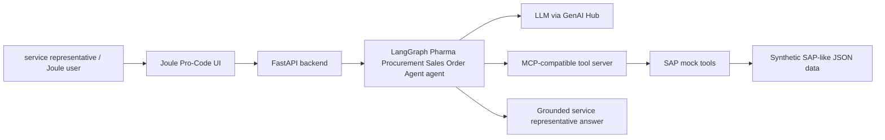

# Pharma Procurement Sales Order Agent Layer

## Scope

This prototype adds a Pharma Procurement Sales Order Agent agent layer to the existing Joule agent template. It focuses on the technical architecture, not on confirming the final customer scope.

The goal is to show how a Joule Pro-Code UI can call a backend agent that decomposes a service representative question, selects tools, reads SAP-like structures, and returns a consolidated answer.

## Runtime shape

| Layer | Prototype implementation | Notes |
| --- | --- | --- |
| UI / channel | Joule Pro-Code scenario and FastAPI endpoint | Joule calls `/api/joule/pharma-order`; direct backend calls use `/api/pharma-order/ask`. |
| Backend API | FastAPI | Local backend training port: `8056`. |
| Agent orchestration | LangGraph / LangChain | ReAct-style graph with assistant node, tool node, and iterative tool calling. |
| Tool protocol | MCP-compatible local stdio server | The local MCP server wraps Python tools now and can later be replaced by remote MCP servers. |
| SAP data access | Synthetic JSON-backed mock tools | No live S/4HANA integration in the first prototype. |
| Model access | Existing project GenAI Hub helper | The provider/model can be overridden by environment or request parameters. |

## Main endpoints

| Endpoint | Purpose | Authentication |
| --- | --- | --- |
| `GET /api/pharma-order/health` | Lightweight health check | No API key |
| `POST /api/pharma-order/ask` | Direct backend agent call | `X-API-Key` |
| `POST /api/joule/pharma-order` | Joule-compatible adapter | Destination / Joule runtime controls access |
| `GET /api/joule/pharma-order` | Manual smoke-call adapter | Destination / Joule runtime controls access |

## Agent flow

## Tool catalog

| Tool | SAP-like source | Example question |
| --- | --- | --- |
| `get_pricing_for_customer_material` | Sales order simulation, list price, customer compliance | What is the price for Northstar for Glycemor 10 mg? |
| `get_material_availability` | Material stock, batch, NDC catalog | Is Glycemor available for shipment this week? |
| `get_order_status` | Sales order header, item, partner, pricing, schedule line, text | What is the status of sales order 5000001234? |
| `lookup_customer_by_dea` | Customer DEA / GTS lookup | Is this DEA number valid for the customer? |
| `lookup_customer_recent_orders` | Sales order history | Show recent Northstar orders. |
| `lookup_batch_expiry` | Batch / lot / expiry status | Is batch INV10-A0426 still usable? |
| `lookup_material_by_ndc` | Material and NDC catalog | Which material maps to NDC 50458-579-30? |
| `check_duplicate_po` | Sales order history | Did we already receive PO PO-100456? |
| `list_blocked_orders` | Sales order status and blocks | Which MetroMed Wholesale orders are blocked? |
| `set_or_clear_order_block` | Preview-only sales order block update | Clear the delivery block on this order. |
| `get_invoice_pdf` | Billing document PDF metadata | Can I get the invoice PDF for this order? |

## Data sources

| File | Purpose |
| --- | --- |
| `API_SALES_ORDER_SIMULATION_SRV__pricing_simulations.json` | Customer/material pricing simulation examples |
| `API_MATERIAL_STOCK_SRV__material_stock_availability.json` | Stock, ATP-like availability, and plant-level constraints |
| `API_SALES_ORDER_SRV__sales_orders_header_item_partner_status.json` | Sales order header, item, partner, status, schedule, text context |
| `API_BATCH_SRV__batch_expiry_lot_status.json` | Batch, lot, expiry, quality, and recall/quarantine context |
| `API_BILLING_DOCUMENT_SRV__invoice_pdf_metadata.json` | Billing document and invoice PDF metadata |
| `ZSD_EXTERNAL_INFO__customers_dea_gts_lookup.json` | Customer DEA, GTS, and compliance lookup data |
| `ZAPI_DEL_LIST_PRICE_V4__materials_ndc_catalog.json` | Product catalog, NDC, GTIN, dosage, and pack attributes |
| `PHARMA_ORDER_SCENARIOS__sample_questions_tool_mapping.json` | Sample pharmaceutical order support questions and intended tool mapping |

## Local ports

| Component | Port |
| --- | --- |
| Backend FastAPI | `8056` |
| UI dev server | `5178` |
| UI preview server | `4178` |

## Productive path

1. Keep Joule, backend, agent orchestration, model access, and tool execution independent.
2. Replace synthetic JSON tools with real SAP API clients when the value of live integration is clear.
3. Move local MCP tools to remote MCP servers if a distributed tool runtime is needed.
4. Add authorization, audit logging, write-back controls, and data masking before productive usage.
5. Treat whitelisted LLM selection and fine-tuning as a separate stream because it affects governance, cost, model lifecycle, and security.
