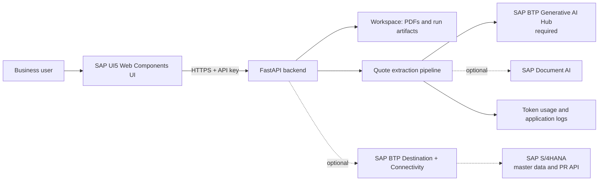

# Quote to Purchase Requisition with SAP BTP AI

A reference application that converts supplier quote PDFs into structured purchase-requisition proposals. It combines an SAP UI5 Web Components frontend, a FastAPI backend, and document extraction through SAP BTP Generative AI Hub.

The repository contains no customer documents, credentials, service keys, or saved extraction results.

## Capabilities

- Upload one supplier quote PDF.
- Extract quote headers and line items with a multimodal model from SAP BTP Generative AI Hub.
- Detect scanned PDFs and use a vision-capable extraction route.
- Review extracted values and the proposed PR payload.
- Persist run artifacts locally for troubleshooting and repeatable review.
- Log model and token usage through the included observability module.
- Optionally compare master data and create a PR in SAP S/4HANA.
- Optionally enable SAP Document AI scenarios.

## Architecture



The editable Mermaid source is available in [`docs/architecture.mmd`](docs/architecture.mmd).

## Prerequisites

- Python 3.12
- Node.js 22 and npm 10
- SAP BTP Generative AI Hub / SAP AI Core service credentials
- Access to the configured multimodal model, by default `gemini-2.5-flash`

SAP Document AI, HANA Cloud, and S/4HANA are not required for the default extraction flow.

## Local setup

### 1. Configure the backend

```powershell
cd api
Copy-Item .env.example .env
```

Fill the five `AICORE_*` values and replace `API_KEY`. Keep `DOCAI_ENABLED=false` and `S4_INTEGRATION_ENABLED=false` for the minimal setup.

```powershell
python -m venv .venv
.venv\Scripts\Activate.ps1
python -m pip install --upgrade pip
python -m pip install -r requirements.txt
python -m uvicorn app.main:app --host 127.0.0.1 --port 8056
```

Verify the backend at `http://127.0.0.1:8056/api/health`.

### 2. Configure the frontend

Open a second terminal:

```powershell
cd ui
Copy-Item .env.example .env
npm ci
npm run dev -- --host 127.0.0.1 --port 5178
```

Set `VITE_API_KEY` to the same value as backend `API_KEY`, then open `http://127.0.0.1:5178/purchase-requisition`.

## Cloud Foundry deployment

Copy the variable template and fill your routes and SAP AI Core service-key values:

```powershell
Copy-Item vars.example.yml vars.yml
cf push --vars-file vars.yml
```

`vars.yml` is ignored by Git. For production, prefer SAP BTP service bindings and XSUAA over manifest variables and a browser-visible API key.

Cloud Foundry storage is ephemeral. Bind a durable object store or database if uploaded PDFs and run history must survive restaging.

## Optional SAP integrations

- **SAP Document AI:** copy `service_key.json.example` to `service_key.json`, provide service credentials, and set `DOCAI_ENABLED=true`.
- **SAP S/4HANA:** configure direct credentials locally or BTP Destination and Connectivity in Cloud Foundry, then set `S4_INTEGRATION_ENABLED=true`.

See [`docs/configuration.md`](docs/configuration.md) for the complete configuration contract.

## Validation

```powershell
cd api
python -m pip install -r requirements-dev.txt
python -m compileall app benchmark_lab observability dox_client
python -m pytest ../tests/unit/test_customer_fast_flow.py ../tests/unit/test_llm_usage_logging.py test_pr_payload_material_mapping.py test_purchasing_intelligence.py test_s4_master_data_plant.py -q

cd ../ui
npm ci
npm run build
```

Tests do not make live model or S/4HANA calls.

## Safety

Creating a purchase requisition is disabled by default. Enabling S/4HANA integration can create a real business document, so review the generated payload and system-specific defaults before using the create action.

## License

Apache License 2.0. See [`LICENSE`](LICENSE).
